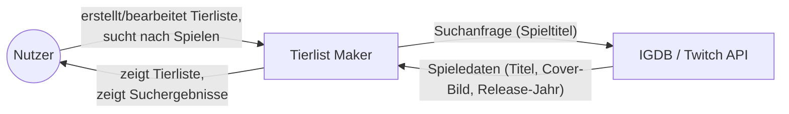
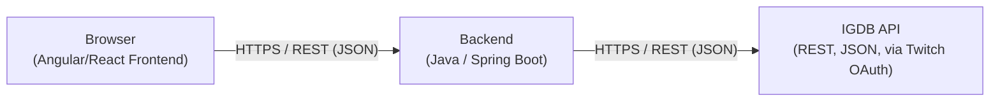

# 3. Kontextabgrenzung

Die Kontextabgrenzung grenzt den Tierlist Maker gegen alle
Kommunikationspartner (Nutzer und Nachbarsysteme) ab und legt damit
fest, welche Verantwortung das System selbst trägt und welche bei
externen Systemen liegt.

## Fachlicher Kontext

| Kommunikationsbeziehung | Eingabe | Ausgabe |
|---|---|---|
| Nutzer ↔ Tierlist Maker | Suchbegriff für Spiele, Anordnung der Spiele in Tier-Stufen, Name/Titel der Tierlist | Dargestellte Suchergebnisse (Titel + Bild), fertige/gespeicherte Tierlist, Teilen-Link |
| Tierlist Maker ↔ IGDB/Twitch API | Suchanfrage (Spieltitel), Authentifizierung (Client-ID/Access-Token) | Liste passender Spiele mit Titel, Cover-/Artwork-Bild-URL, Release-Jahr, IGDB-ID |

**Erläuterung**: Der Nutzer interagiert ausschließlich mit dem Tierlist
Maker – er sucht dort nach Spielen und ordnet sie per Drag & Drop in
Tier-Stufen ein. Die eigentliche Spielsuche wird intern an IGDB
weitergereicht; der Nutzer bekommt nur das Ergebnis (Titel + Bild)
angezeigt und merkt im Idealfall nicht, dass eine externe API im
Hintergrund arbeitet.

*(TODO: falls später ein Teilen/Export-Feature dazukommt – z.B. Export
als Bild oder öffentlicher Link – hier als weitere
Kommunikationsbeziehung ergänzen.)*

## Technischer Kontext

| Technischer Kanal | Protokoll/Format | Fachliche Ein-/Ausgabe, die darüber fließt |
|---|---|---|
| Browser ↔ Backend | HTTPS, REST-API, JSON | Suchanfragen, Tierlisten-Daten (Anlegen, Bearbeiten, Speichern, Abrufen) |
| Backend ↔ IGDB/Twitch API | HTTPS, REST-API, JSON, Twitch-OAuth (Client Credentials) | Spielsuche und Spieledaten (Titel, Bild-URL, Release-Jahr, IGDB-ID) |

**Erläuterung**: Das Frontend kommuniziert ausschließlich mit dem
eigenen Backend – nie direkt mit IGDB. Das Backend übernimmt die
Authentifizierung gegenüber der Twitch-API (Client-ID/Secret bleiben
serverseitig) und reicht Suchanfragen an IGDB weiter. Das schützt die
API-Zugangsdaten und erlaubt es, z.B. später ein Caching der
IGDB-Antworten im Backend einzubauen, ohne das Frontend anzupassen.

*(TODO: Frontend-Framework final festlegen – siehe Randbedingungen
Kapitel 2 – und hier eintragen, sobald entschieden.)*