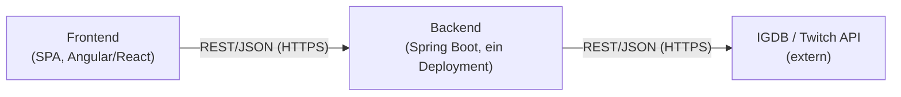
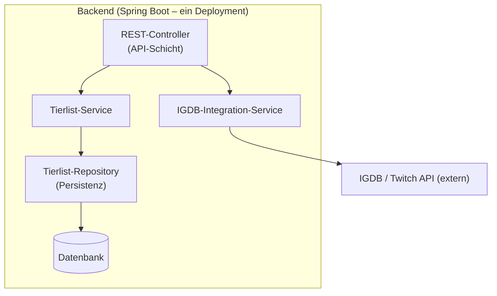

# 5. Bausteinsicht

Die Bausteinsicht zeigt die statische Zerlegung des Tierlist Makers in
Bausteine und deren Abhängigkeiten, ausgehend von der in Kapitel 4
beschriebenen Client-Server-Architektur mit intern SOA-strukturiertem
Backend.

## Whitebox Gesamtsystem

**Begründung**: Die Zerlegung in Ebene 1 folgt direkt der
Client-Server-Aufteilung aus Kapitel 4 – Frontend und Backend sind
unabhängig voneinander entwickel- und austauschbar (z.B. Wechsel
Angular ↔ React), solange die REST-Schnittstelle stabil bleibt.

**Enthaltene Bausteine**

| Name | Verantwortung |
|---|---|
| Frontend | Darstellung der Tierlisten, Suche/Anzeige von Spielen, Drag & Drop der Einträge in Tier-Stufen; kommuniziert ausschließlich mit dem Backend. |
| Backend | Stellt die REST-API für das Frontend bereit; verwaltet Tierlisten-Daten; kapselt die Kommunikation mit IGDB. Läuft als ein einziges Deployment, intern in Services gegliedert (siehe Ebene 2). |

**Wichtige Schnittstellen**

| Schnittstelle | Beschreibung |
|---|---|
| Backend-REST-API (Frontend ↔ Backend) | JSON über HTTPS; Endpunkte u.a. zum Suchen von Spielen, Anlegen/Bearbeiten/Abrufen von Tierlisten. |
| IGDB-API (Backend ↔ IGDB) | Externe REST-API von IGDB/Twitch; Details siehe Kapitel 3 (Kontextabgrenzung). |

## Ebene 2

Da das Frontend noch nicht final festgelegt ist (Angular oder React,
siehe Kapitel 2) und intern weitgehend Standardaufbau eines SPA-
Frameworks hat, wird an dieser Stelle nur das **Backend** als
komplexerer und architekturell relevanterer Baustein vertieft.

### Whitebox *Backend*

**Begründung**: Innerhalb des Backends folgt die Zerlegung dem in
Kapitel 4 festgelegten SOA-Ansatz: Die beiden fachlichen
Kernverantwortlichkeiten (Tierlisten-Verwaltung und externe
Datenbeschaffung über IGDB) sind als eigene Services gekapselt und nur
über klar definierte Schnittstellen (Java-Interfaces) erreichbar, auch
wenn alles im selben Prozess/Deployment läuft.

**Enthaltene Bausteine**

| Name | Verantwortung |
|---|---|
| REST-Controller | Nimmt HTTP-Anfragen vom Frontend entgegen, validiert Eingaben, delegiert an den passenden Service, formt die Antwort als JSON. |
| Tierlist-Service | Fachlogik rund um Tierlisten: Anlegen, Bearbeiten, Speichern, Abrufen von Tierlisten inkl. Tier-Stufen und Einträgen. |
| IGDB-Integration-Service | Kapselt Authentifizierung und Kommunikation mit der externen IGDB/Twitch-API; bietet eine eigene, von IGDB unabhängige Such-Schnittstelle an; übernimmt optional Caching von Suchergebnissen. |
| Tierlist-Repository | Persistenzschicht für Tierlisten-Daten (z.B. via Spring Data), kapselt Datenbankzugriffe. |
| Datenbank | Speichert Tierlisten, Tier-Stufen und referenzierte Spiele-Einträge (Titel, IGDB-ID, Bild-URL) dauerhaft. |

**Wichtige Schnittstellen**

| Schnittstelle | Beschreibung |
|---|---|
| Tierlist-Service-Interface | Internes Java-Interface, über das der REST-Controller Tierlisten-Operationen aufruft; kein Netzwerkaufruf, direkter In-Process-Methodenaufruf. |
| IGDB-Integration-Service-Interface | Internes Java-Interface für Spielsuche; verbirgt vor dem restlichen Backend, dass die Daten von IGDB stammen – ermöglicht späteren Austausch/Erweiterung der Datenquelle (siehe Kapitel 4, Wartbarkeit). |

*(TODO: sobald Persistenz-Technologie feststeht – z.B. PostgreSQL,
H2 für lokale Entwicklung – hier ergänzen. TODO: sobald Frontend-
Framework feststeht, ggf. Ebene 2 für das Frontend ergänzen, falls dort
relevante/komplexe Struktur entsteht, z.B. State-Management für die
Drag&Drop-Tier-Liste.)*

## Ebene 3

Noch nicht relevant – wird ergänzt, sobald einzelne Bausteine aus
Ebene 2 (z.B. der IGDB-Integration-Service mit Caching-Logik) so
komplex werden, dass eine weitere Vertiefung sinnvollen Mehrwert
bietet.