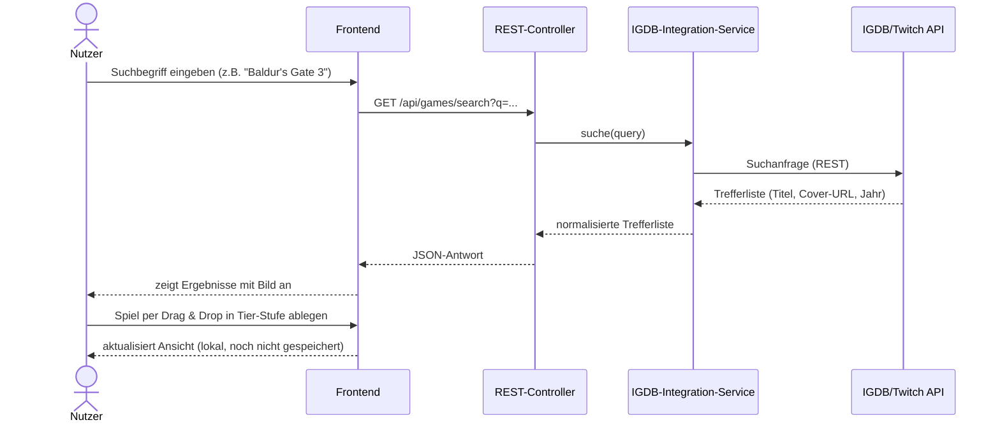
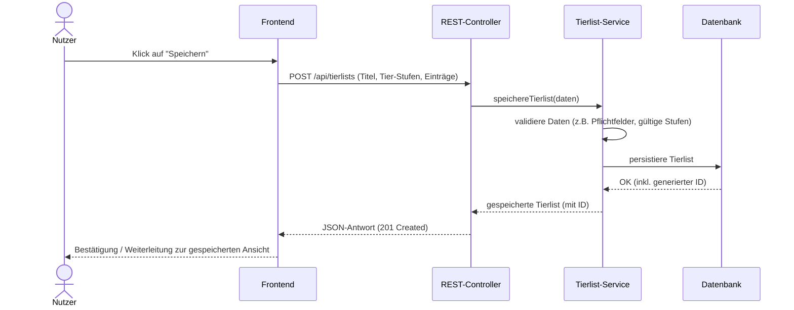
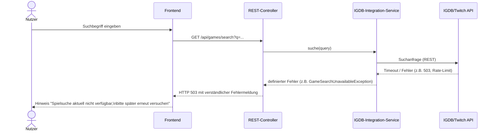

# 6. Laufzeitsicht

Diese Sicht beschreibt die aus Architektursicht relevantesten Abläufe
des Tierlist Makers anhand konkreter Szenarien.

## Spiel suchen und zur Tierlist hinzufügen

Zentraler Ablauf des Systems: Der Nutzer sucht ein Spiel über IGDB und
ordnet es einer Tier-Stufe zu.

**Besonderheiten**: Die Zuordnung per Drag & Drop wird zunächst nur im
Frontend-Zustand gehalten; ein Speichern-Aufruf (siehe nächstes
Szenario) ist ein separater, bewusster Schritt des Nutzers. Der
IGDB-Integration-Service liefert bereits normalisierte Daten
(einheitliches Format), sodass Controller und Frontend nicht wissen
müssen, wie die IGDB-Antwort intern aussieht.

## Tierlist speichern

**Besonderheiten**: Die Validierung liegt bewusst im Tierlist-Service
(nicht im Controller oder Frontend), damit fachliche Regeln zentral an
einer Stelle im Backend geprüft werden, unabhängig davon, über welchen
Weg ein Speichern-Aufruf ausgelöst wird.

## Fehlerfall: IGDB-API nicht erreichbar

Adressiert das Qualitätsziel "Zuverlässigkeit der externen Anbindung"
aus Kapitel 1.

**Besonderheiten**: Der IGDB-Integration-Service fängt technische
Fehler (Timeout, HTTP-Fehlercodes, Rate-Limit-Überschreitung) ab und
übersetzt sie in eine definierte, fachliche Fehlerantwort. Dadurch
stürzt das Backend nicht ab, und bereits gespeicherte Tierlisten
bleiben unabhängig davon nutzbar, da der Tierlist-Service von diesem
Fehler nicht betroffen ist (Vorteil der Service-Trennung aus Kapitel 4
und 5).

*(TODO: sobald ein Caching im IGDB-Integration-Service umgesetzt ist,
hier ein weiteres Szenario ergänzen, das zeigt, wie bei einem
IGDB-Ausfall zumindest bereits gecachte Suchergebnisse weiter genutzt
werden können.)*