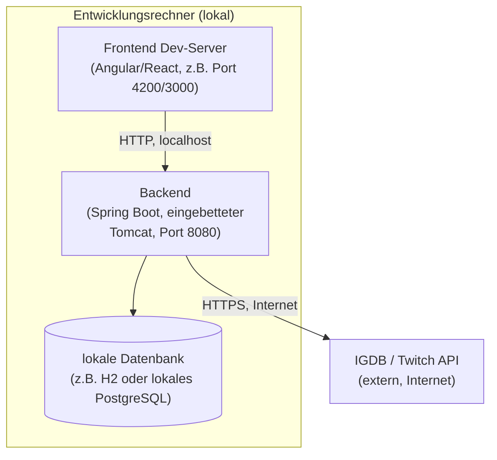
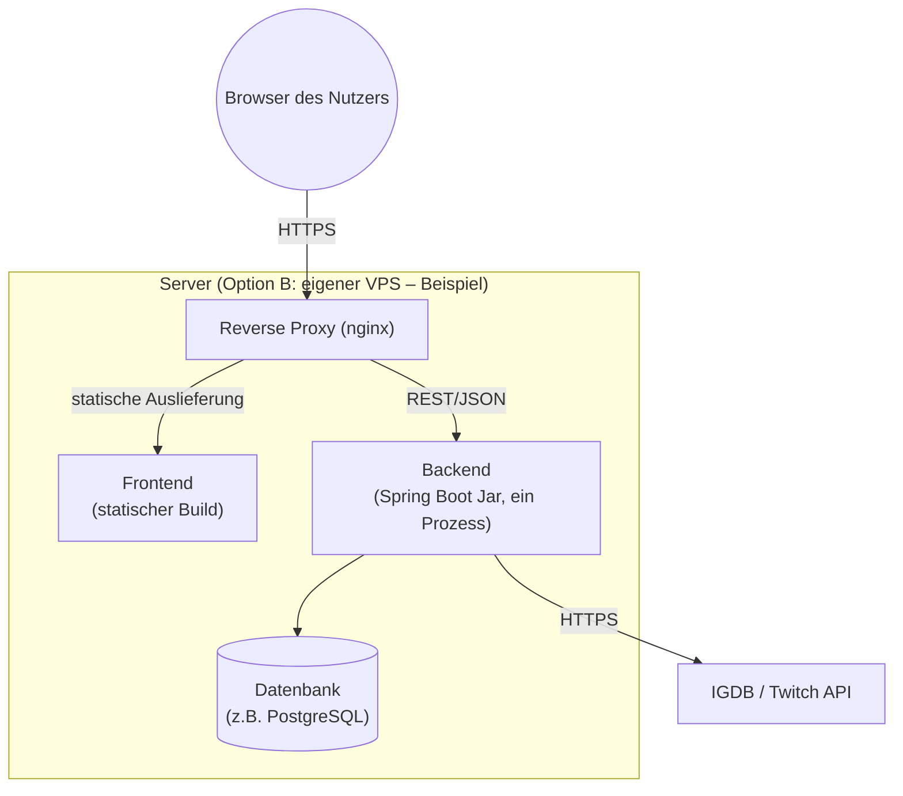

# 7. Verteilungssicht

Da das Hosting noch nicht final entschieden ist (siehe Kapitel 2), wird
hier zunächst die **Entwicklungsumgebung** konkret beschrieben sowie
**Optionen für eine spätere Produktivumgebung** skizziert, die als
Grundlage für die endgültige Entscheidung dienen.

## Infrastruktur Ebene 1 – Entwicklungsumgebung

**Begründung**: Für die Entwicklung als Solo-Hobbyprojekt reicht ein
einzelner Rechner. Frontend-Dev-Server und Backend laufen als separate
Prozesse lokal, um schnelles Hot-Reloading im Frontend zu ermöglichen,
während das Backend über die reale (oder eine Sandbox-)IGDB-API
angesprochen wird.

**Qualitäts-/Leistungsmerkmale**: Keine besonderen Anforderungen in der
Entwicklungsumgebung; Fokus liegt auf schneller Iteration, nicht auf
Verfügbarkeit oder Skalierung.

**Zuordnung von Bausteinen zu Infrastruktur**

| Baustein (aus Kap. 5) | Infrastrukturelement |
|---|---|
| Frontend | Frontend Dev-Server (lokal) |
| Backend inkl. Tierlist-Service, IGDB-Integration-Service | Backend-Prozess (lokal, eingebetteter Server) |
| Tierlist-Repository / Datenbank | Lokale Datenbank (z.B. H2 in-memory oder lokales PostgreSQL) |

## Infrastruktur Ebene 1 – Produktivumgebung (Optionen, noch offen)

Da die Hosting-Entscheidung noch aussteht, werden zwei realistische
Optionen für ein Solo-Hobbyprojekt gegenübergestellt:

| Option | Beschreibung | Vorteile | Nachteile |
|---|---|---|---|
| **A: Managed/Free-Tier-Hosting** (z.B. Frontend auf Vercel/Netlify, Backend auf Render/Railway o.ä.) | Frontend als statischer Build ausgeliefert, Backend als verwalteter Container-/App-Dienst. | Wenig Betriebsaufwand, oft kostenlose Einstiegsstufen, einfaches Deployment (z.B. via Git-Push). | Free-Tier-Limits (z.B. Cold-Starts, begrenzte Rechenzeit), weniger Kontrolle. |
| **B: Eigener VPS** | Frontend (statische Dateien) und Backend (Jar) auf einem gemieteten Server, z.B. hinter einem Reverse Proxy (nginx). | Volle Kontrolle, ein Server für alles, planbare Kosten. | Muss selbst administriert werden (Updates, Sicherheit, Monitoring) – zusätzlicher Aufwand für Solo-Entwickler. |

**Zuordnung von Bausteinen zu Infrastruktur (Option B, beispielhaft)**

| Baustein (aus Kap. 5) | Infrastrukturelement |
|---|---|
| Frontend | Statischer Build, ausgeliefert über Reverse Proxy |
| Backend inkl. Services | Ein Backend-Prozess (Spring Boot Jar) auf dem Server |
| Datenbank | Datenbankinstanz auf demselben oder einem separaten Server |

*(TODO: Hosting-Option final festlegen (siehe Kapitel 2) und dieses
Kapitel entsprechend auf die tatsächliche Produktivumgebung
zuschneiden; nicht gewählte Option kann dann entfernt werden.)*

## Infrastruktur Ebene 2

Noch nicht relevant, solange die Produktivinfrastruktur aus wenigen,
einfachen Elementen besteht (ein Server bzw. wenige verwaltete
Dienste). Wird bei Bedarf ergänzt, z.B. falls später Load-Balancing,
mehrere Backend-Instanzen oder ein CDN für Bilder hinzukommen.